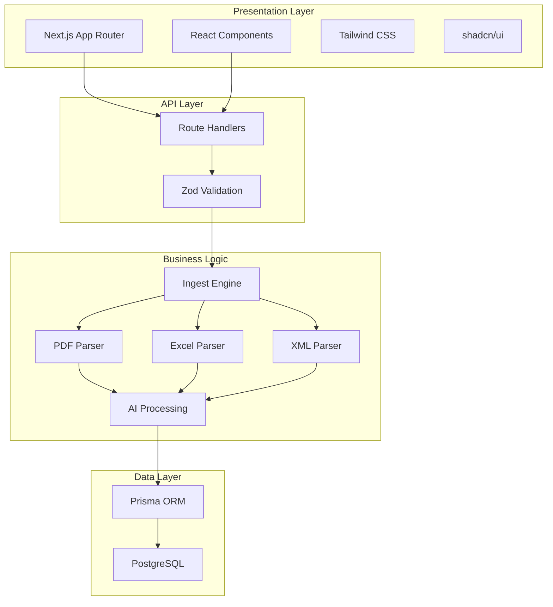
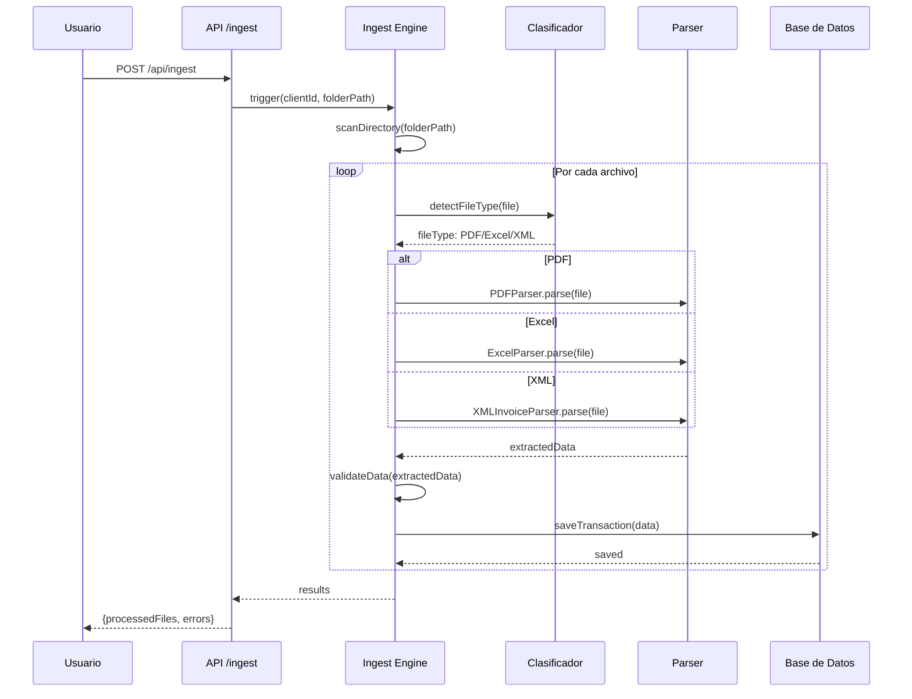
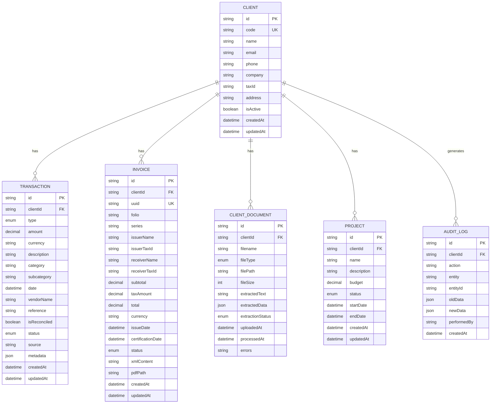
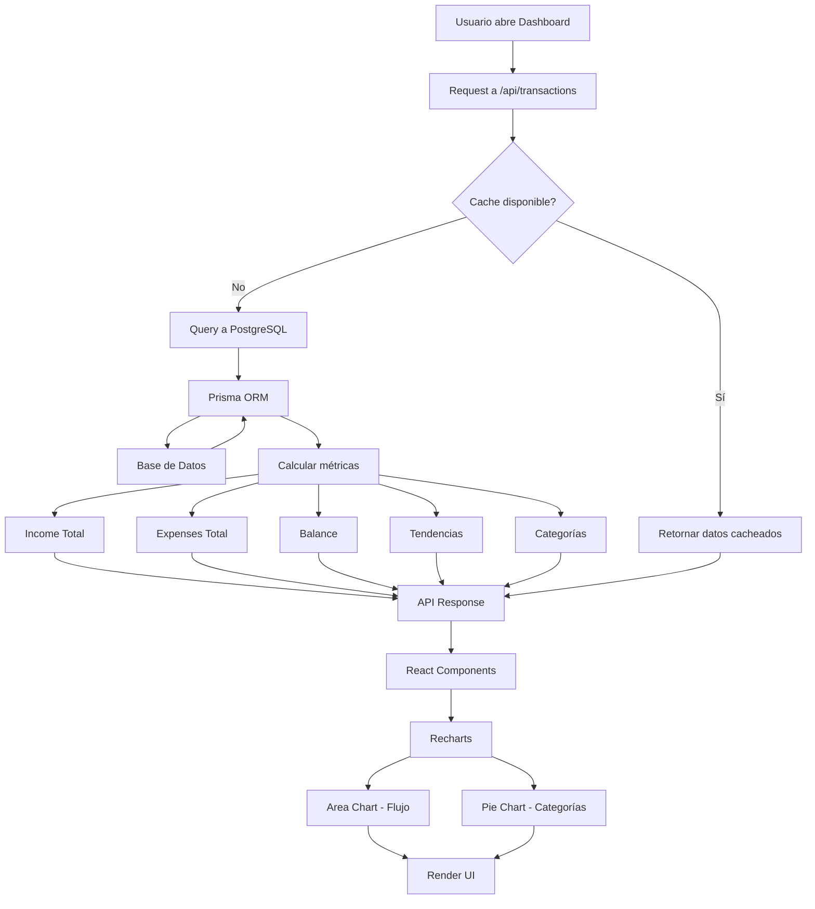
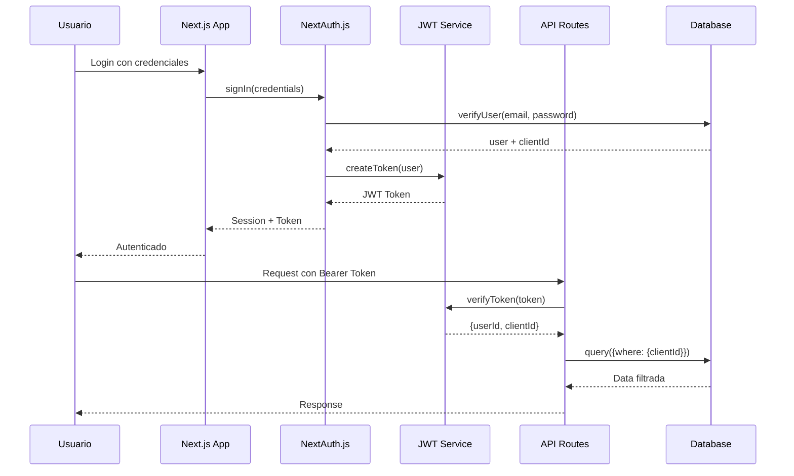
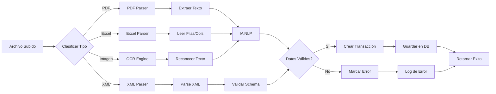
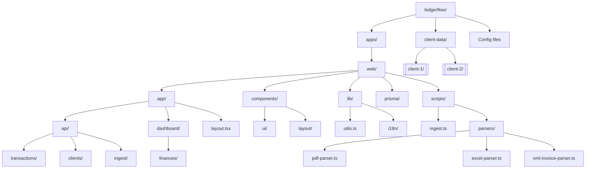
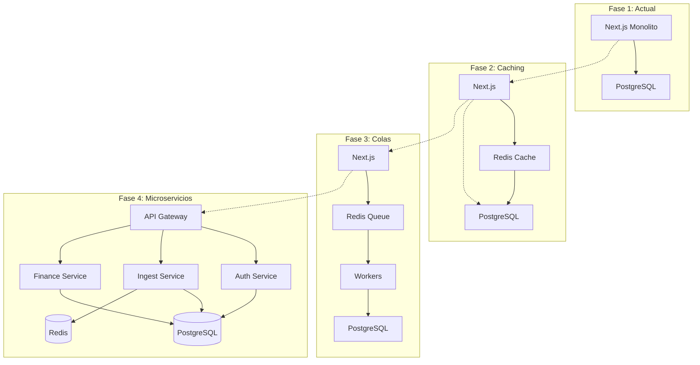
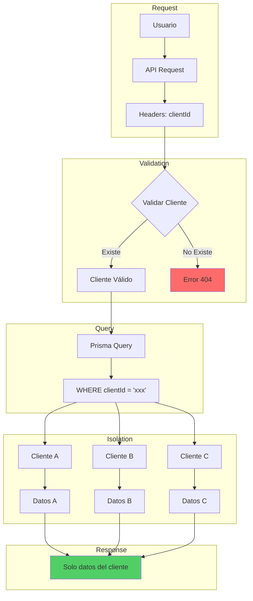

# Diagramas del Sistema - LedgerFlow

Colección de diagramas Mermaid para visualizar la arquitectura y flujos de LedgerFlow.

---

## 1. Arquitectura General

---

## 2. Flujo de Ingesta de Documentos

---

## 3. Modelo de Datos (Entidad-Relación)

---

## 4. Dashboard Financiero - Flujo de Datos

---

## 5. Autenticación y Autorización (Futuro)

---

## 6. Pipeline de Procesamiento de Documentos

---

## 7. Estructura del Proyecto

---

## 8. Escalabilidad - Roadmap Arquitectura

---

## 9. Seguridad - Multi-tenancy

---

## Cómo Ver estos Diagramas

Estos diagramas usan la sintaxis **Mermaid**. Para visualizarlos:

1. **VS Code**: Instalar extensión "Markdown Preview Mermaid Support"
2. **GitHub**: Se renderizan automáticamente en archivos .md
3. **Mermaid Live Editor**: https://mermaid.live
4. **Obsidian**: Soporte nativo con plugin Mermaid

---

**[← Volver al README](./LEDGERFLOW-README.md)**

